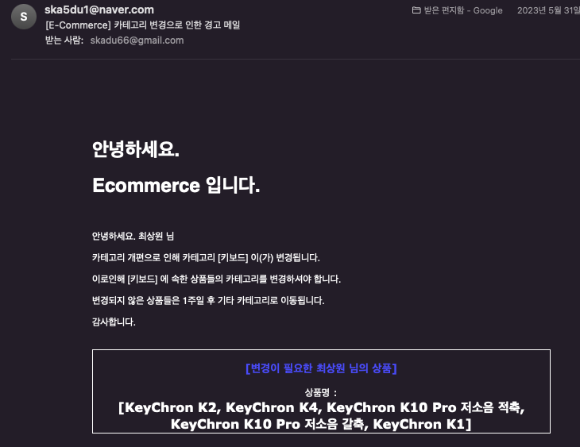
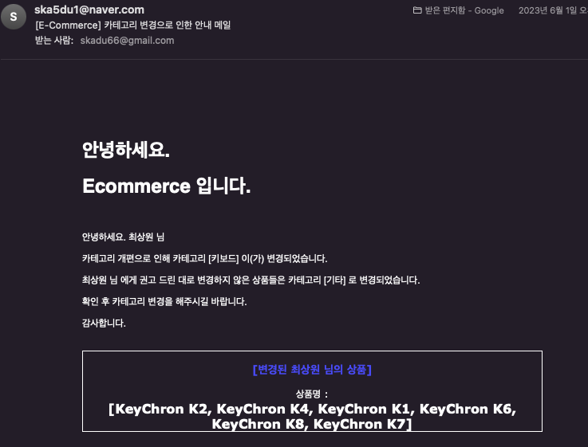

## 👨🏻‍💻  Admin ( 관리자 )


- 회원가입
    - **API** : `/api/admin/join`
    - **Method : POST**
    - **Body :  raw (json)**
    - **Request**

    ```jsonc
    {
      "name" : 이름,
      "nickname": 닉네임,
      "email": user의 로그인 ID에 해당,
      "password": 비밀번호,
      "pnum": 전화번호,
      "birth" : 생일,
      "region" : 시/도,
      "city": 읍/면/구,
      "street": 도로명,
      "detail": 상세주소,
      "zipcode": 우편번호
    }
    ```

    - **Response**
        - 200 OK
        ```jsonc
        {id} 회원가입 되었습니다.
        ```
        - 409 *CONFLICT*
        ```jsonc
        이미 가입된 이메일입니다.
        ```
        ```jsonc
        다른 사용자가 사용중인 닉네임입니다.
        ```
        ```jsonc
        이미 등록된 휴대폰 번호입니다.
        ```
<br/>

- 사용자 조회
    - **API** : `/api/admin/searchUsers/{id}?Params`
    - **Method : GET**
    - **Request**
    ```jsonc
    "id" : id 를 통해 관리자인지 체크
    ```
    ```Params
    {Params} 동적
    {
      userStatus : COMMON, SELLER, ADMIN 검색 가능
      size : 페이지 최대 표시 수
      page : 페이지 번호
    }
    ```
    - **Response**
      - 200 OK
      ```jsonc
      Page
      ```
      - 406 *NOT_ACCEPTABLE*
      ```jsonc
      조회할 권한이 없습니다.
      ```
<br/>

- COMMON-SELLER, SELLER-COMMON 변경 요청 로그 검색
    - **API** : `/api/admin/searchChangeStatusLogs/{id}?Params`
    - **Method : GET**
    - **Request**
    ```jsonc
    "id" : id 를 통해 관리자인지 체크
    ```
    ```Params
    {Params} 동적
    {
      userId : 요청한 사용자의 Id
      adminId : 요청을 처리한 관리자의 Id
      timeGoe : 크거나 같은 요청시간
      timeLoe : 작거나 같은 요청시간
      logStat : 처리 상태 -> WAIT, CANCLE, OK 검색 가능
      size : 페이지 최대 표시 수
      page : 페이지 번호
    }
    ```
    - **Response**
      - 200 OK
      ```jsonc
      Page
      ```
      - 406 *NOT_ACCEPTABLE*
      ```jsonc
      조회할 권한이 없습니다.
      ```
<br/>

- COMMON-SELLER, SELLER-COMMON 변경
    - **API** : `/api/admin/changeStatus/{logId}`
    - **Method : POST**
    - **Body :  raw (json)**
    - **Request**
    ```jsonc
    "logId" 를 통해 요청 선택
    ```
    ```jsonc
    {
      "adminId" : 관리자 Id,
      "stat" : 처리 종류 -> OK, CANCEL
    }
    ```

    - **Response**
      - 200 OK
      ```jsonc
      요청이 성공적으로 처리되었습니다.
      ```
      - 404 *NOT_FOUND*
      ```jsonc
      존재하지 않는 요청입니다.
      ```
      ```jsonc
      존재하지 않는 회원의 요청입니다.
      ```
      - 406 *NOT_ACCEPTABLE*
      ```jsonc
      조회할 권한이 없습니다.
      ```
      - 409 *CONFLICT*
      ```jsonc
      이미 처리된 요청입니다.
      ```
<br/>

- 카테고리 생성
    - **API** : `/api/admin/createCategory/{adminId}`
    - **Method : POST**
    - **Body : raw(json)**

    - **Request**

        ```jsonc
        "adminId" : adminId 를 통하여 관리자 확인
        ```
        ```jsonc
        {
        "name" : 카테고리 이름,
        "parentId" : 부모 카테고리 ID,
        }
        ```

    - **Response**
        - 200 OK
        ```
        {상품이름} 의 주문상태가 변경되었습니다.
        ```
        - 404 *NOT_FOUND*
        ```
        카테고리를 다시 확인해 주세요.
        ```
        - 406 *NOT_ACCEPTABLE*
        ```
        조회할 권한이 없습니다.
        ```
        - 409 *CONFLICT*
        ```
        이미 존재하는 카테고리 이름입니다.
        ```
<br/>

- 카테고리 내 상품 조회 (자식 카테고리 포함)
    - **API** : `/api/seller/checkCategoryItem/{adminId}/{categoryId}`
    - **Method : GET**

    - **Request**

        ```jsonc
        "adminId" : adminId 를 통하여 판매자 확인
        "categoryId" : categoryId 를 통하여 카테고리 확인
        ```

    - **Response**
        - 200 OK
        ```
        List<CategoryItemDto>
        CategoryItemDto
        {
            "sellerId": 판매자 Id,
            "sellerName": 판매자 이름,
            "sellerEmail": 판매자 이메일,
            "categoryName": 카테고리 이름,
            "itemId": 상품 Id,
            "itemName": 상품 이름
        }
        ```
        - 404 *NOT_FOUND*
        ```
        카테고리를 다시 확인해 주세요.
        ```
        ```
        카테고리에 등록된 상품이 없습니다.
        ```
        - 406 *NOT_ACCEPTABLE*
        ```
        조회할 권한이 없습니다.
        ```
<br/>

- 카테고리 내 상품의 판매자들에게 경고 메일 전송
    - **API** : `/api/seller/sendMailCategoryWarning/{adminId}/{categoryId}`
    - **Method : GET**

    - **Request**

        ```jsonc
        "adminId" : adminId 를 통하여 판매자 확인
        "categoryId" : categoryId 를 통하여 카테고리 확인
        ```

    - **Response**
        - 200 OK
        
        ```
        {판매자 이름들} 에게 메일 전송 완료
        ```
        - 404 *NOT_FOUND*
        ```
        카테고리를 다시 확인해 주세요.
        ```
        ```
        카테고리에 등록된 상품이 없습니다.
        ```
        - 406 *NOT_ACCEPTABLE*
        ```
        조회할 권한이 없습니다.
        ```
<br/>

- 카테고리 내 상품 카테고리 일괄 변경 후 메일 발송
    - **API** : `/api/admin/batchChangeItemCategory/{adminId}`
    - **Method : POST**
    - **Body : raw(json)**

    - **Request**
        ```jsonc
        "adminId" : adminId 를 통하여 관리자 확인
        ```
        ```jsonc
        {
        "categoryId" : 기존 카테고리 Id,
        "changeCategoryId" : 변경할 카테고리 Id,
        }
        ```

    - **Response**
        - 200 OK
        
        ```
        [변경된 상품들]
        [변경전 카테고리 이름] 에서 [변경된 카테고리 이름] 로 변경 완료
        ```
        - 404 *NOT_FOUND*
        ```
        카테고리를 다시 확인해 주세요.
        ```
        ```
        카테고리에 등록된 상품이 없습니다.
        ```
        - 406 *NOT_ACCEPTABLE*
        ```
        조회할 권한이 없습니다.
        ```
<br/>

- 카테고리 내 상품 카테고리 일괄 변경 후 메일 발송
    - **API** : `/api/admin/deleteCategory/{adminId}`
    - **Method : POST**
    - **Body : raw(json)**

    - **Request**
        ```jsonc
        "adminId" : adminId 를 통하여 관리자 확인
        ```
        ```jsonc
        {
        "categoryId" : 카테고리 Id
        }
        ```

    - **Response**
        - 200 OK
        ```
        [카테고리 이름] 이(가) 삭제되었습니다.
        ```
        - 404 *NOT_FOUND*
        ```
        카테고리를 다시 확인해 주세요.
        ```
        - 406 *NOT_ACCEPTABLE*
        ```
        조회할 권한이 없습니다.
        ```
        - 409 *CONFLICT*
        ```
        카테고리 내에 등록된 상품이 있습니다. 변경 혹은 삭제후 다시 시도해 주세요.
        ```
<br/>