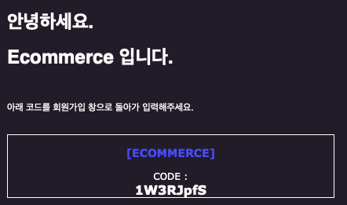

## 📧 Mail ( 메일 )

- 매일 전송
    - **API** : `/api/mail/sendMail/{userEmail}`
    - **Method : GET**

    - **Request**

        ```jsonc
        "userEmail" : userEmail 에게 랜덤 인증코드 발송
        ```

    - **Response**
        - 200 OK
        
        ```
        인증코드가 발송 되었습니다.
        ```
<br/>

- 매일 인증
    - **API** : `/api/mail/validateEmail`
    - **Method : POST**
    - **Body : raw(json)**

    - **Request**

        ```jsonc
        {
            "email" : 사용자의 이메일,
            "authCode" : 인증코드
        }
        ```

    - **Response**
        - 200 OK
        ```
        {email} 인증 성공
        ```
        - 203 *NON_AUTHORITATIVE_INFORMATION*  
        ```jsonc
        잘못된 인증코드 입니다.
        ``` 
        - 404 *NOT_FOUND*
        ```
        만료된 인증코드 혹은 잘못된 키 입니다.
        ```
<br/>