## 💵 Payment ( 결제 )

- 사용자[결제, 주문/결제 취소], 판매자[교환/환불 신청서 확인, 주문/결제 취소]
    - **Url** : `/paymentHome`
    - **Method : GET**

    - **Page**
        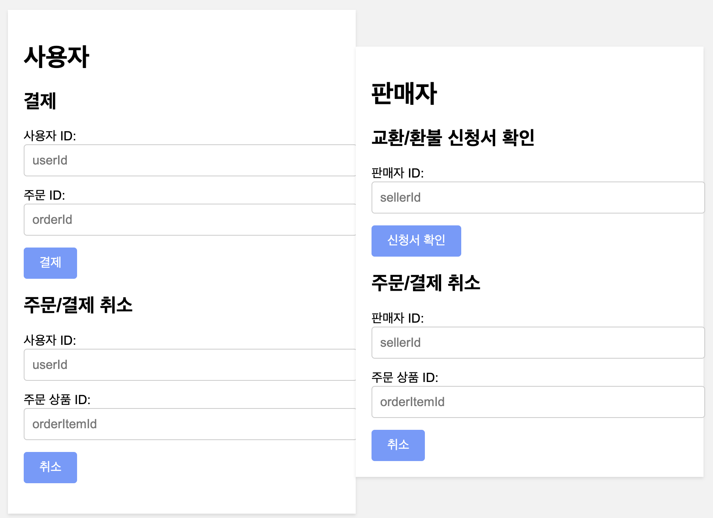
        - 사용자 결제
            - **Method : POST**
            - **Action : /payment**
            - **Request**
            ```
            "paymentUserId" : 사용자 Id,
            "orderId" : 주문 Id
            ```
        - 사용자 주문/결제 취소
            - **Method : POST**
            - **Action : /cancelOrderHome**
            - **Request**
            ```
            "cancelPaymentUserId" : 사용자 Id,
            "orderItemId" : 주문 상품 Id
            ```
        - 판매자 교환/환불 신청서 확인
            - **Method : GET**
            - **Action : /getExchangeRefundLogs/{sellerId}?size=5&page=0**
            ```
            "sellerId" : 판매자 Id
            ```
        - 판매자 주문/결제 취소
            - **Method : POST**
            - **Action : /seller/cancelOrderHome**
            - **Request**
            ```
            "cancelPaymentSellerId" : 판매자 Id,
            "orderItemIdForSeller" : 주문 상품 Id
            ```
<br/>

- 결제
    - **Url** : `/payment`
    - **Method : POST**
    - **Body : raw(json)**

    - **Request**

        ```jsonc
        {
            "paymentUserId" : 구매자 Id,
            "orderId" : 주문 Id
        }
        ```

    - **Page**
        - page - main
        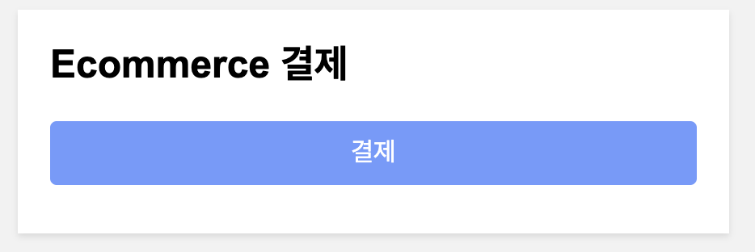
        - page - kakaoQR
        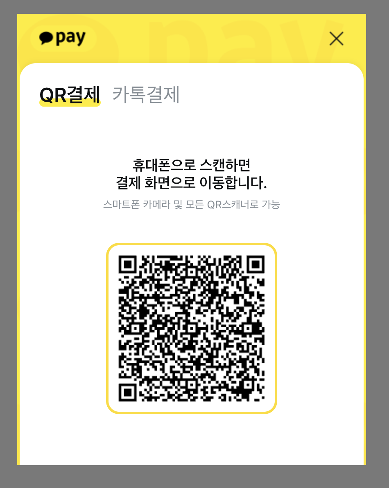
        - mobile - kakaoPay
        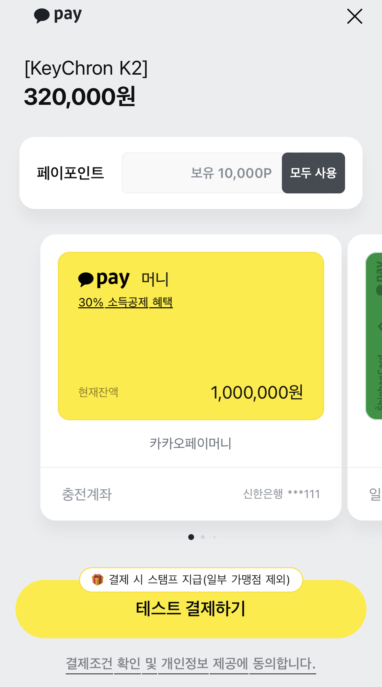
        - successLog

             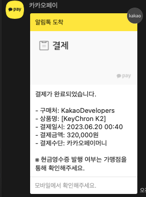
        - successAlert
        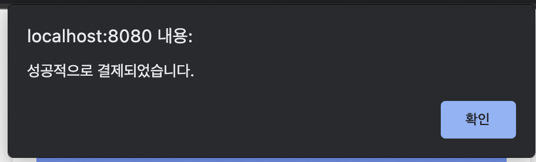
        - failAlert
        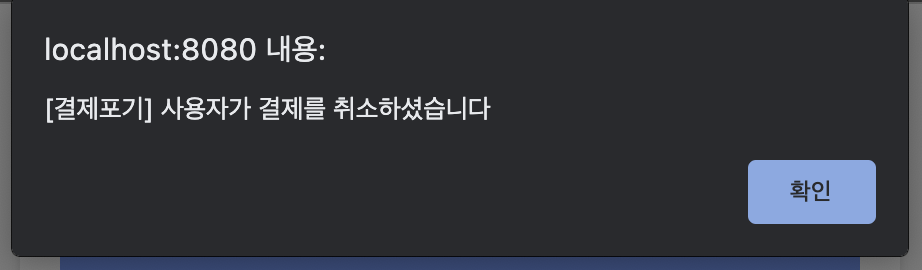
    
    - **Error Page**
        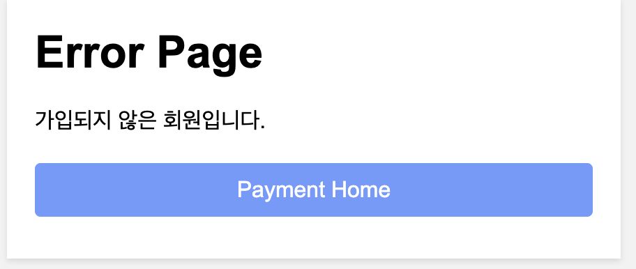
        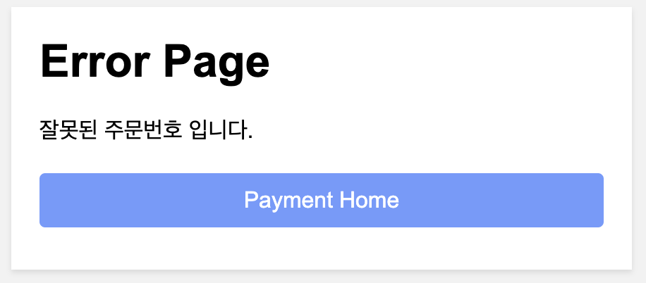
        
        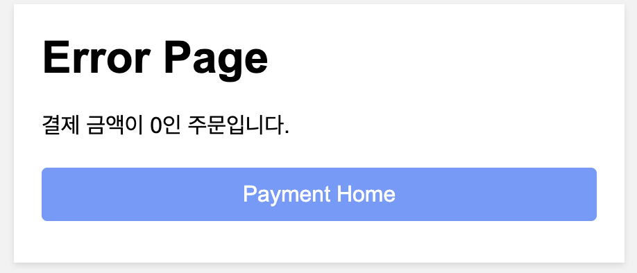
        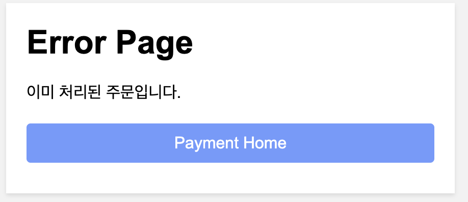

<br/>

- 결제 검증
    - **Url** : `verifyIamPort`
    - **Method : POST**
    - **Body : raw(json)**
        ```jsonc
        {
            "imp_uid" : 결제 번호,
            "amount" : 결제 가격,
            "orderId" : 주문 Id
        }
        ```
    - **Response**
        - 200 OK
        ```
        IamportResponse<Payment>
        ```
        - VerifyIamportException
        ```
        PortOne 서버 결제 금액이 다릅니다.
        주문서와 결제 금액이 다릅니다.
        ```
<br/>

- 결제 취소(결제 검증 중 오류 발생)
    - **Url** : `/cancelPayments`
    - **Method : POST**
    - **Body : raw(json)**
        ```jsonc
        {
            "imp_uid" : 결제 번호,
            "reason" : "결제금액 위/변조. 결제금액이 일치하지 않습니다.",
            "checksum" : 결제 가격,
            "refundHolder" : 구매자 이름
        }
        ```
    - **Response**
        - 200 OK
        ```
        결제 취소
        ```
        - VerifyIamportException
        ```
        환불금액 위/변조. 환불금액이 일치하지 않습니다.
        ```
<br/>


- 사용자 주문/결제 취소
    - **Url** : `/cancelOrderHome`
    - **Method : POST**

    - **Request**

        ```jsonc
        {
            "cancelPaymentUserId" : 주문/결제 취소 구매자 Id,
            "orderItemId" : 주문 상품 Id
        }
        ```
    - **Page**
        - page - main(결제 전 주문)
        
        - 주문취소
           - **Action : /cancelOrder/{orderItemId}**
           - **Method : POST**
           - **Request**
           ```
           "reason" : 미입력시 "구매자에 의한 취소"
           ```
           - **Success**
           ```
           alert - 주문이 성공적으로 취소되었습니다
           ```
           - **Error**
           ```
           alert - 주문 취소 중 오류가 발생했습니다: + error message
           ```
        - page - main(결제된 주문)
        
        - 결제취소
            - **Action : /cancelPayments**
            - **Method : POST**
            - **Request**
           ```
           "paymentUid" : 결제 번호,
           "reason" : 미입력시 "구매자에 의한 취소",
           "checkSum" : 환불 금액,
           "refundHolder" : 구매자 이름,
           "orderItemId" : 결제 취소 주문 상품 Id
           ```
            - **Success**
           ```
           alert - 결제가 성공적으로 취소되었습니다
           ```
           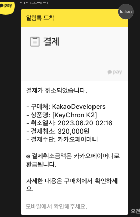
            - **Error**
           ```
           alert - 결제 취소 중 오류가 발생했습니다: + error message
           ```
    - **Error Page**
        
        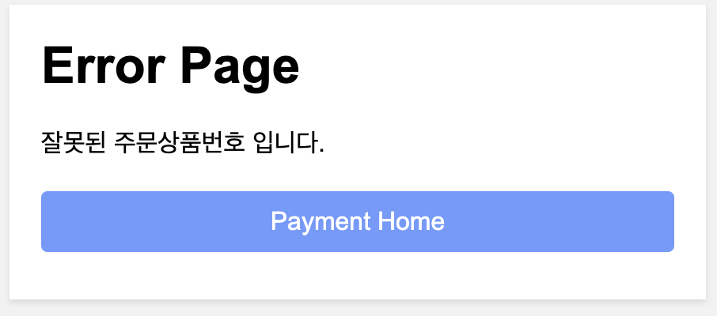
        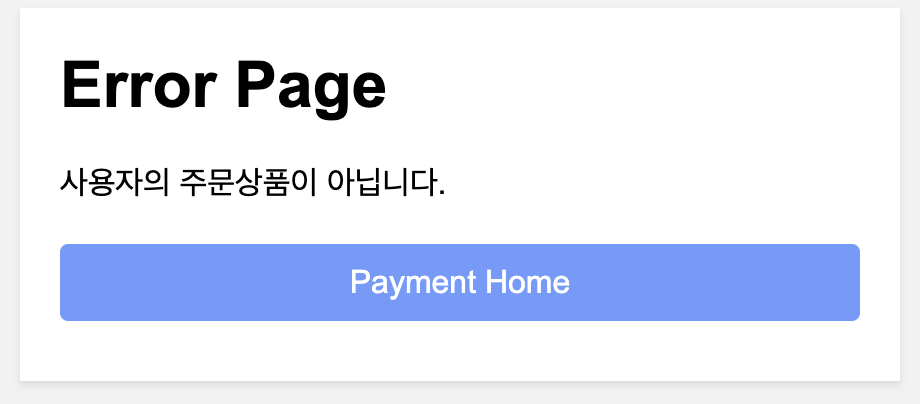
        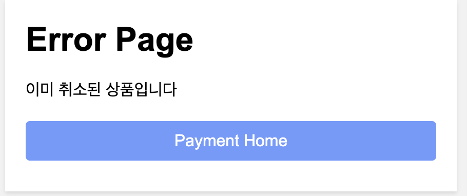
        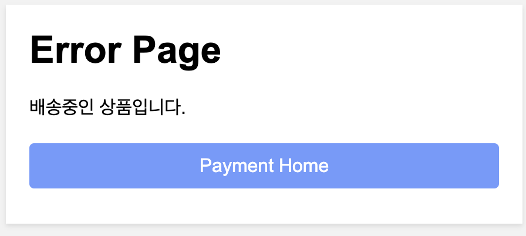
        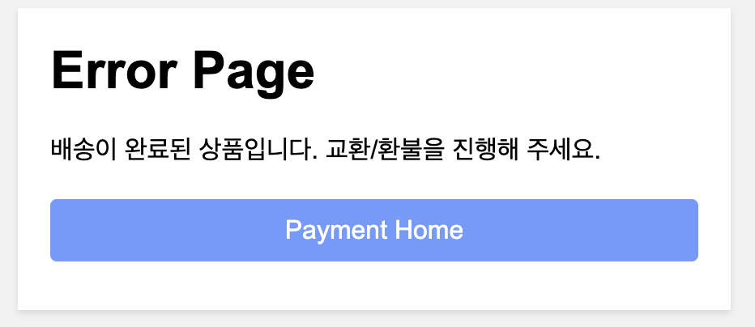

<br/>

- 판매자 - 교환/환불 신청서 확인
    - **Url** : `/getExchangeRefundLogs/{sellerId}?size=5&page=0&Params`
    - **Method : GET**
    - **Request**
  
        ```jsonc
        "sellerId" : sellerId 를 통해 판매자 확인
        ```
        ```
        {Params} 동적
        {
        "status" : 교환/환불 종류,
        "logStatus" : 신청 상태,
        "timeGoe" : 
        "size" : 페이지 최대 표시 수,
        "page" : 페이지 번호
        }
        ```
    - **Page**
        - page - main(항목 없음)
          
        - page - main
          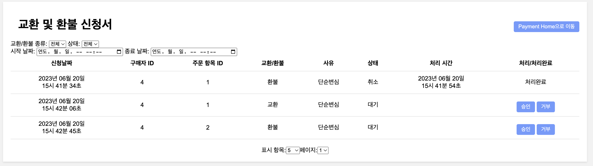
        - 승인/거부
            - **Action : /processingERLog**
            - **Method : POST**
            - **Request**
           ```
           "logId" : 신청서 Id,
           "okOrCancel" : true = ok, false = cancel
           ```
            - **Success**
           ```
           alert - 성공적으로 처리되었습니다.
           ```
            - **Error**
           ```
           alert - 처리 중 오류가 발생했습니다: + error message
           ```
    - **Error Page**
      
      

<br/>

- 판매자 주문/결제 취소
    - **Url** : `/seller/cancelOrderHome`
    - **Method : POST**

    - **Request**

        ```jsonc
        {
            "cancelPaymentSellerId" : 주문/결제 취소 판매자 Id,
            "orderItemIdForSeller" : 주문 상품 Id
        }
        ```
    - **Page**
        - page - main(결제 전 주문)
          
        - 주문취소
            - **Action : /cancelOrder/{orderItemId}**
            - **Method : POST**
            - **Request**
           ```
           "reason" : 미입력시 "판매자에 의한 취소"
           ```
            - **Success**
           ```
           alert - 주문이 성공적으로 취소되었습니다
           ```
            - **Error**
           ```
           alert - 주문 취소 중 오류가 발생했습니다: + error message
           ```
        - page - main(결제된 주문)
          
        - 결제취소
            - **Action : /cancelPayments**
            - **Method : POST**
            - **Request**
           ```
           "paymentUid" : 결제 번호,
           "reason" : 미입력시 "판매자에 의한 취소",
           "checkSum" : 환불 금액,
           "refundHolder" : 구매자 이름,
           "orderItemId" : 결제 취소 주문 상품 Id
           ```
            - **Success**
           ```
           alert - 결제가 성공적으로 취소되었습니다
           ```
          
            - **Error**
           ```
           alert - 결제 취소 중 오류가 발생했습니다: + error message
           ```
    - **Error Page**
      
      
      
      